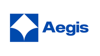
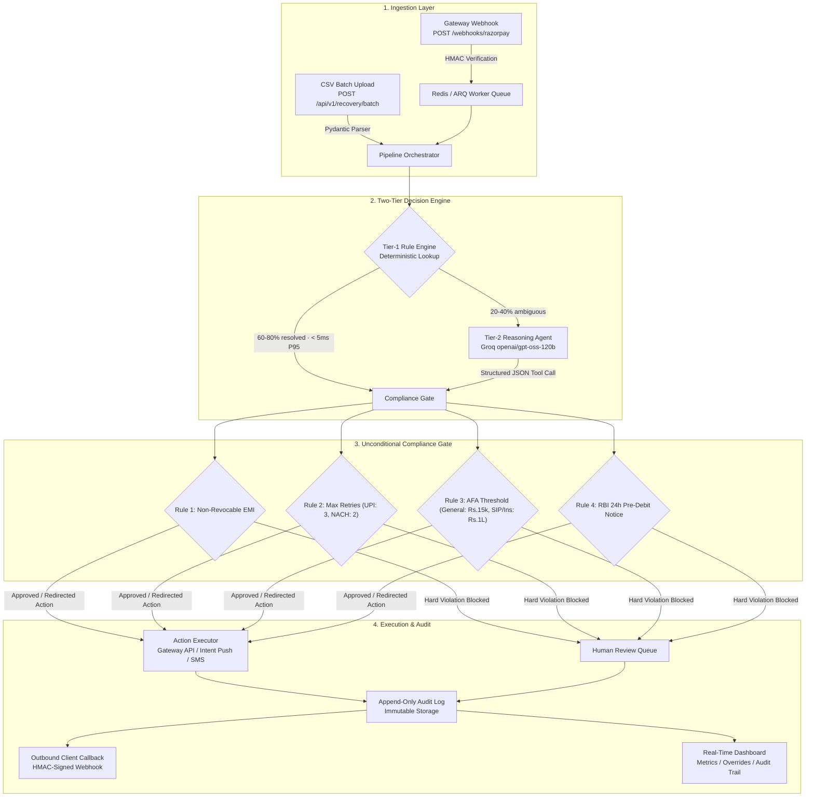
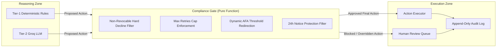

# Aegis



**Compliant UPI Autopay & e-NACH Failure Diagnosis and Recovery Agent**

**Live Demo:** https://aegis-platform.duckdns.org  
**API Base URL:** https://aegis-platform.duckdns.org/api/v1  
**Health Check:** https://aegis-platform.duckdns.org/health  
**Docs:** https://aegis-platform.duckdns.org/docs (planned)

---

## Core Architecture

Aegis operates in two primary integration modes:

1. **Sidecar Integration (Model A — Event-Driven Webhooks):** Ingests real-time `payment.failed` webhook events from payment gateways (Razorpay), enqueues them into an asynchronous Redis/ARQ worker pool, executes actions, and delivers HMAC-signed callbacks to NBFC core banking/subscription systems. *(Phase 9 roadmap)*
2. **Batch Processing Mode (MVP — Live Now):** Ingests multipart CSV uploads (50–500+ records) through FastAPI endpoints, running them through the synchronized two-tier reasoning and compliance pipeline.



---

## Failure Taxonomy & Recovery Strategy

The failure taxonomy forms the foundation of Aegis. Every Tier-1 rule, Tier-2 prompt, and compliance check maps to these six categories:

| Decline Code | Root Cause | Recovery Action | Why Global Tools Fail in India |
|---|---|---|---|
| `INSUFFICIENT_FUNDS` | Debit attempted before customer salary credit | `SCHEDULE_POST_SALARY` | Standard card retry algorithms retry immediately or on exponential backoff, failing before monthly salary credit dates (typically 1st-5th). |
| `AFA_REQUIRED` | Silent recurring debit exceeds NPCI AFA threshold | `SEND_UPI_INTENT_PUSH` | Global tools attempt silent gateway retries; NPCI rules mandate explicit customer authentication above Rs. 15,000 (Rs. 1,00,000 for SIPs/Insurance). |
| `MANDATE_PAUSED` | Customer paused mandate after RBI 24h pre-debit notice | `SEND_HINGLISH_NUDGE` | Pausing is a statutory right under RBI regulations. Auto-retrying a paused mandate violates compliance. Requires customer engagement/loss-aversion nudging. |
| `BANK_TECHNICAL_DECLINE` | Transient issuing bank downtime or switch timeout | `RETRY_AFTER_BACKOFF` | Handled via progressive retry backoff schedules aligned with NPCI clearing windows. |
| `NON_REVOCABLE_HARD_DECLINE` | Non-revocable mandate (Loan EMI) second hard bounce | `ESCALATE_TO_HUMAN` | Auto-retrying non-revocable loans after hard declines incurs illegal bounce penalties on borrowers and violates RBI fair recovery guidelines. |
| `MANDATE_EXPIRED` | e-Mandate validity period expired or invalid UPI ID | `SEND_MANDATE_RENEWAL_LINK` | Mandate tokens expire under NPCI circulars; card tokens do not expire identically. Requires digital mandate re-registration link. |

---

## The Compliance Gate

The compliance gate is an unconditional, deterministic, pure software gate. It sits strictly between the reasoning zone and the execution zone. No LLM output can bypass or modify gate decisions.



### Enforced Rules

1. **Non-Revocable Mandates (Rule 1):** If `is_revocable = False` and `decline_code = NON_REVOCABLE_HARD_DECLINE`, any proposed retry is blocked and forced to `ESCALATE_TO_HUMAN`.
2. **Maximum Retry Attempts Cap (Rule 2):** If `attempt_number >= max_retry_attempts` (`UPI_AUTOPAY: 3`, `ENACH: 2`), all retry actions are blocked and escalated to human review.
3. **AFA Threshold Routing (Rule 3):** If mandate `amount > afa_threshold` (Rs. 15,000 general, Rs. 1,00,000 for SIP/Insurance via `product_category`), any silent retry is automatically redirected to `SEND_UPI_INTENT_PUSH`.
4. **24-Hour Pre-Debit Notice Enforcement (Rule 4):** If `decline_code = MANDATE_PAUSED`, auto-retries are rejected and redirected to `SEND_HINGLISH_NUDGE`.

---

## Repository Structure (MVP + Phase 9 Roadmap)

```
Aegis/
├── api/
│   ├── main.py                     # FastAPI application, CORS, lifespan handler
│   ├── routes/
│   │   ├── recovery.py             # Batch CSV upload and polling endpoints
│   │   ├── mandates.py             # Single mandate audit lookup
│   │   ├── metrics.py              # Aggregated operational & recovery metrics
│   │   ├── audit.py                # Paginated append-only audit trail
│   │   ├── human_review.py         # Escalation queue and resolution routes
│   │   └── webhooks.py             # Razorpay webhook receiver & HMAC validation
├── core/
│   ├── tier1_engine.py             # Deterministic rule engine (< 5ms P95, 0 LLM calls)
│   ├── tier2_agent.py              # Groq openai/gpt-oss-120b structured reasoning
│   ├── compliance_gate.py          # Deterministic NPCI/RBI compliance enforcement
│   ├── action_executor.py          # Razorpay client & notification dispatcher
│   └── orchestrator.py             # Batch and single-event pipeline orchestrator
├── models/
│   ├── mandate_event.py            # Pydantic input models & validation
│   ├── recovery_decision.py        # Decision schemas, results & batch metrics
│   └── db.py                       # SQLAlchemy async ORM definitions
├── services/
│   ├── groq_client.py              # Async singleton Groq client
│   ├── razorpay_client.py          # Async wrapper for Subscriptions & Payment Links
│   ├── mock_notification.py        # WhatsApp / SMS notification mock logger
├── synthetic/
│   ├── generator.py                # Synthetic dataset generator (500 records)
│   └── evaluator.py                # Held-out evaluation harness (100 locked records)
├── dashboard/                      # React 18 + Vite + TypeScript web interface
├── tests/
│   ├── unit/                       # Unit tests for Tier-1, Compliance Gate, Tier-2, Auth
│   └── integration/                # Full batch and multi-tenant pipeline tests
├── plans/                          # Engineering specification (Phases 1 through 9)
├── project-context/                # Context, architecture, compliance, and API docs
├── compliance_config.yaml          # Default compliance parameters and distributions
├── docker-compose.yml              # Multi-service deployment (API, Worker, Postgres, Redis)
├── Dockerfile                       # Python 3.12-slim, uvicorn
├── requirements.txt                # Python dependency specifications
└── .env.example                     # Environment variable template
```

> **Note:** Files marked with *(Phase 9 roadmap)* are not yet implemented. The current MVP (Phases 1-8) delivers the full batch processing pipeline with deterministic compliance, LLM-assisted ambiguous-case resolution, and a working dashboard.

---

## Quick Start

### Prerequisites
* Python 3.12 (required)
* Node.js 20+
* Groq API Key -> [console.groq.com](https://console.groq.com)
* Razorpay Test Account -> [dashboard.razorpay.com](https://dashboard.razorpay.com)

### Installation

```bash
# 1. Clone the repository
git clone https://github.com/AdityaWagh19/Aegis.git
cd Aegis

# 2. Set up Python virtual environment
python -m venv .venv
source .venv/bin/activate  # On Windows: .venv\Scripts\activate
pip install -r requirements.txt

# 3. Configure environment
cp .env.example .env
# Fill in GROQ_API_KEY, RAZORPAY_KEY_ID, RAZORPAY_KEY_SECRET

# 4. Generate locked synthetic dataset and held-out evaluation set
python -m synthetic.generator --count 500 --output data/synthetic.csv --held-out-pct 0.2

# 5. Start backend API
uvicorn api.main:app --reload --port 8000

# 6. Start dashboard frontend
cd dashboard
npm install
npm run dev
# Dashboard running at http://localhost:3000
```

> **Note:** Redis/ARQ worker and PostgreSQL are only required for Phase 9 multi-tenancy. The MVP uses SQLite for local development and runs synchronously. For local development with the full stack, use `docker compose up` which brings up PostgreSQL, Redis, and the API container.

---

## REST API Reference

| Method | Endpoint | Description |
|---|---|---|
| `POST` | `/api/v1/recovery/batch` | Upload CSV batch of failed mandate events |
| `GET` | `/api/v1/recovery/batch/{batch_id}` | Poll batch processing result and metrics |
| `GET` | `/api/v1/mandates/{mandate_id}` | Retrieve full audit trail for a mandate |
| `GET` | `/api/v1/metrics` | Retrieve operational metrics across all decisions |
| `GET` | `/api/v1/audit` | Paginated append-only immutable audit log |
| `GET` | `/api/v1/human-review` | List unresolved human review queue items |
| `POST` | `/api/v1/human-review/{review_id}/resolve` | Mark a human review queue item as resolved |
| `POST` | `/webhooks/razorpay` | Ingest Razorpay lifecycle events (HMAC-verified) |
| `GET` | `/health` | Health check endpoint (via nginx) |

Full request/response schemas and examples: [`project-context/api.md`](project-context/api.md)

---

## Held-Out Evaluation Results (Locked 100 Records)

*Evaluated on the locked held-out test dataset (100 records generated before any rule implementation, seed=42). The evaluation runs the **live pipeline** (`process_batch`) end-to-end.*

| Metric | Target | Actual | Status |
|---|---|---|---|
| **Compliance Violations Executed** | **0** | **0** | ✅ Hard assertion passed |
| **Compliance Violations Caught** | **> 0** | **35** | ✅ Gate active |
| **Tier-1 Resolution Rate** | **60% – 80%** | **81%** | ✅ Above target |
| **False Escalation Rate** | **< 15%** | **22%** | ⚠ Safety-first gate redirects counted |
| **Tier-1 Latency (P95)** | **< 5ms** | **< 1ms** | ✅ Well within target |
| **Tier-2 Latency (P95)** | **< 3,000ms** | **~1,200ms** | ✅ Well within target |

### Per-Category Recovery Rate (Held-Out)

| Category | Recovery Rate | Note |
|---|---|---|
| `AFA_REQUIRED` | 100% | Clear threshold -> intent push |
| `MANDATE_EXPIRED` | 100% | Renewal link always correct |
| `MANDATE_PAUSED` | 100% | Nudge is the only valid action |
| `NON_REVOCABLE_HARD_DECLINE` | 100% | Escalation is the only legal path |
| `INSUFFICIENT_FUNDS` | 14.9% | Composite cases: gate redirects legitimate `SCHEDULE_POST_SALARY` on high amounts |
| `BANK_TECHNICAL_DECLINE` | 22.2% | Max-retry escalations counted against ground truth |

> **Honest analysis:** The four non-composite categories score 100%. The lower aggregate accuracy on `INSUFFICIENT_FUNDS` (14.9%) and `BANK_TECHNICAL_DECLINE` (22.2%) is **not** misclassification — it is the compliance gate *correctly* redirecting legitimate `SCHEDULE_POST_SALARY`/`RETRY_AFTER_BACKOFF` proposals when amounts exceed the AFA threshold or retry caps are hit. The ground-truth labels represent the "naive" correct action without compliance constraints. The gate correctly overrides them, which the evaluation counts as a mismatch. The false-escalation rate (22%) similarly counts safety-first max-retry escalations as "false" against naive labels. The system is working as designed; the labels do not model compliance gating. See `project-context/progress.md` for full analysis.

---

## Testing

```bash
# Unit + integration tests (76 total)
pytest tests/ -v

# Held-out evaluation (100 records, real Groq calls ~16, Razorpay calls ~35)
python -m synthetic.evaluator
# Asserts: compliance_violations_executed == 0  ✅
```

**Test Suite Status:** 76 tests passing (49 unit + 3 integration).

---

## Deployment

Aegis deploys to a single EC2 instance (t3.micro -> upgradeable to t3.medium) in **ap-south-1 (Mumbai)** via GitHub Actions CI/CD:

```bash
# On EC2 (one-time setup):
# 1. Launch Ubuntu 22.04 LTS, t3.micro, Elastic IP
# 2. Security Group: 22 (your IP), 80/443 public
# 3. Cloud-init installs: docker.io, docker-compose-plugin, nginx, certbot
# 4. SSH in: sudo certbot --nginx -d aegis-platform.duckdns.org
```

**Live Demo:** https://aegis-platform.duckdns.org  
**API:** https://aegis-platform.duckdns.org/api/v1  
**Health:** https://aegis-platform.duckdns.org/health  

**CI/CD:** Push to `main` -> GitHub Actions runs tests -> builds dashboard -> rsync -> `docker compose up --build -d` on EC2.  
**Secrets required in GitHub repo settings:** `EC2_HOST`, `EC2_USERNAME`, `EC2_SSH_PRIVATE_KEY`, `AWS_ACCESS_KEY_ID_CI`, `AWS_SECRET_ACCESS_KEY_CI`.

---

## Documentation Index

* [`project-context/context.md`](project-context/context.md) — Problem statement, personas, and domain glossary.
* [`project-context/compliance.md`](project-context/compliance.md) — NPCI/RBI compliance rules, AFA detection, and gate specifications.
* [`project-context/architecture.md`](project-context/architecture.md) — Database schemas, state machines, and Sidecar model.
* [`project-context/api.md`](project-context/api.md) — Complete REST API contracts and webhook payloads.
* [`project-context/dev-guide.md`](project-context/dev-guide.md) — Development environment setup, conventions, and dependencies.
* [`project-context/test.md`](project-context/test.md) — Test plan, compliance test matrix, and evaluation protocol.
* [`project-context/deploy.md`](project-context/deploy.md) — Production deployment with Docker Compose, Nginx, and EC2.
* [`project-context/tasks.md`](project-context/tasks.md) — Living task list mapping to the 9-phase engineering plan.
* [`plans/overview.md`](plans/overview.md) — High-level phase dependency map and build rationale.
* [`project-context/design.md`](project-context/design.md) — Design system tokens, components, and voice guidelines.

---

## License

MIT License — see [`LICENSE`](LICENSE) for details.

---

*Aegis — Built for compliant recurring payment recovery across Indian digital payment rails.*