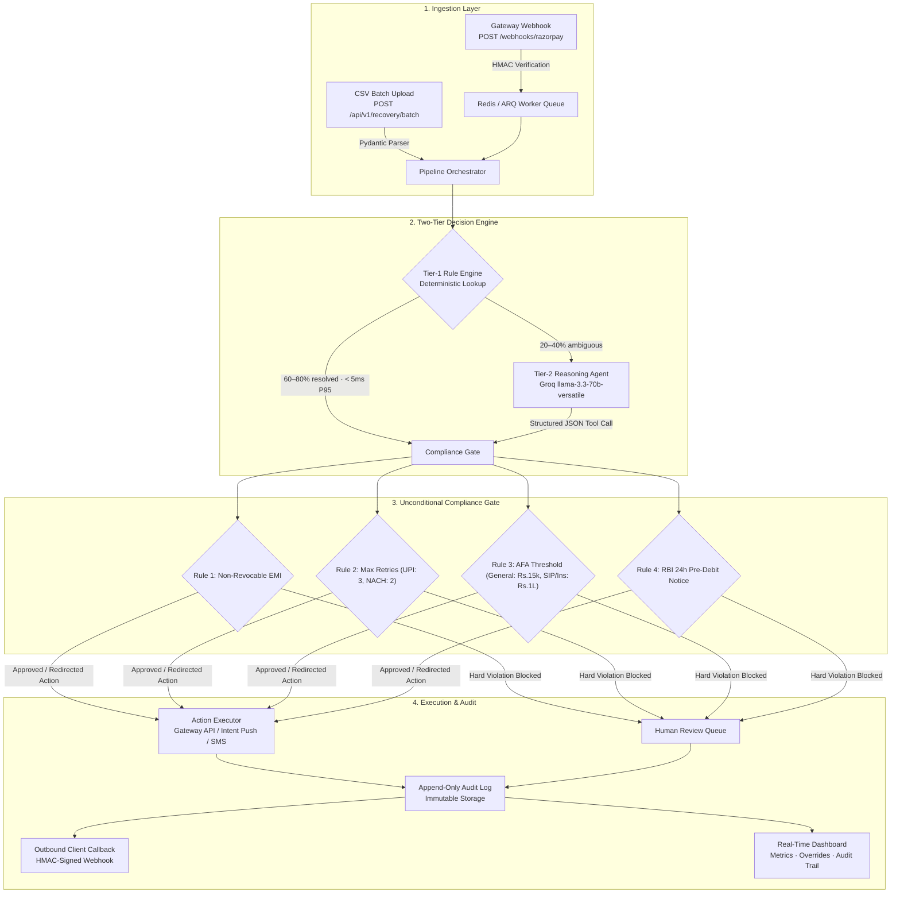
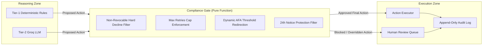

# Aegis

**Compliant UPI Autopay & e-NACH Failure Diagnosis and Recovery Agent**

Indian subscription businesses and Non-Banking Financial Companies (NBFCs) lose 10–20% of recurring revenue to mandate execution failures across UPI Autopay and e-NACH rails. These failure modes are structural to the Indian payments ecosystem: they involve NPCI mandate mechanics, RBI pre-debit notification constraints, AFA thresholds, and salary-cycle timing that global dunning tools (Stripe Smart Retries, Churnkey, Butter Payments) do not support.

Aegis is a bolt-on Sidecar and batch recovery system that diagnoses mandate failures by root cause, selects legally compliant recovery actions, executes them via payment gateway APIs (e.g. Razorpay test/live modes), and guarantees zero regulatory violations through an unconditional, deterministic compliance gate.

---

## Core Architecture

Aegis operates in two primary integration modes:
1. **Sidecar Integration (Model A - Event-Driven Webhooks):** Ingests real-time `payment.failed` webhook events from payment gateways (Razorpay), enqueues them into an asynchronous Redis/ARQ worker pool, executes actions, and delivers HMAC-signed callbacks to NBFC core banking/subscription systems.
2. **Batch Processing Mode:** Ingests multipart CSV uploads (50–500+ records) through FastAPI endpoints, running them through the synchronized two-tier reasoning and compliance pipeline.



---

## Failure Taxonomy & Recovery Strategy

The failure taxonomy forms the foundation of Aegis. Every Tier-1 rule, Tier-2 prompt, and compliance check maps to these six categories:

| Decline Code | Root Cause | Recovery Action | Why Global Tools Fail in India |
|---|---|---|---|
| `INSUFFICIENT_FUNDS` | Debit attempted before customer salary credit | `SCHEDULE_POST_SALARY` | Standard card retry algorithms retry immediately or on exponential backoff, failing before monthly salary credit dates (typically 1st–5th). |
| `AFA_REQUIRED` | Silent recurring debit exceeds NPCI AFA threshold | `SEND_UPI_INTENT_PUSH` | Global tools attempt silent gateway retries; NPCI rules mandate explicit customer authentication above ₹15,000 (₹1,00,000 for SIPs/Insurance). |
| `MANDATE_PAUSED` | Customer paused mandate after RBI 24h pre-debit notice | `SEND_HINGLISH_NUDGE` | Pausing is a statutory right under RBI regulations. Auto-retrying a paused mandate violates compliance. Requires customer engagement/loss-aversion nudging. |
| `BANK_TECHNICAL_DECLINE` | Transient issuing bank downtime or switch timeout | `RETRY_AFTER_BACKOFF` | Handled via progressive retry backoff schedules aligned with NPCI clearing windows. |
| `NON_REVOCABLE_HARD_DECLINE` | Non-revocable mandate (Loan EMI) second hard bounce | `ESCALATE_TO_HUMAN` | Auto-retrying non-revocable loans after hard declines incurs illegal bounce penalties on borrowers and violates RBI fair recovery guidelines. |
| `MANDATE_EXPIRED` | e-Mandate validity period expired or invalid UPI ID | `SEND_MANDATE_RENEWAL_LINK` | Mandate tokens expire under NPCI circulars; card tokens do not expire identically. Requires digital mandate re-registration link. |

---

## The Compliance Gate

The compliance gate is an unconditional, deterministic, pure software gate. It sits strictly between the reasoning zone and the execution zone. No LLM output can bypass or modify gate decisions.



### Enforced Rules

1. **Non-Revocable Mandates (Rule 1):** If `is_revocable = False` and `decline_code = NON_REVOCABLE_HARD_DECLINE`, any proposed retry is blocked and forced to `ESCALATE_TO_HUMAN`.
2. **Maximum Retry Attempts Cap (Rule 2):** If `attempt_number >= max_retry_attempts` (`UPI_AUTOPAY: 3`, `ENACH: 2`), all retry actions are blocked and escalated to human review.
3. **AFA Threshold Routing (Rule 3):** If mandate `amount > afa_threshold` (`₹15,000` general, `₹1,00,000` for SIP/Insurance via `product_category`), any silent retry is automatically redirected to `SEND_UPI_INTENT_PUSH`.
4. **24-Hour Pre-Debit Notice Enforcement (Rule 4):** If `decline_code = MANDATE_PAUSED`, auto-retries are rejected and redirected to `SEND_HINGLISH_NUDGE`.

---

## Multi-Tenancy & Sidecar Architecture

For production deployments (Phase 9), Aegis provides a multi-tenant sidecar architecture:

* **Per-Tenant Configuration:** Every NBFC/Fintech tenant configures custom AFA thresholds, retry caps, and Groq rate limit quotas.
* **Key Encryption:** Sensitive credentials (`razorpay_key_id`, `razorpay_key_secret`, `callback_secret`, `razorpay_webhook_secret`) are encrypted at rest with Fernet (AES-128-CBC + HMAC-SHA256).
* **API Authentication:** Inbound REST API requests are authenticated via `Authorization: Bearer <api_key>` (SHA-256 hashed lookup).
* **Asynchronous Webhook Queue:** Webhook requests return `200 OK` in < 1 second. Processing executes in ARQ async workers via Redis.
* **Signed Outbound Callbacks:** Decision payloads sent to tenant webhook endpoints carry `X-Aegis-Signature` (`HMAC-SHA256(payload, callback_secret)`).
* **Rate Limiting & Downgrade:** Redis sliding-window limiter tracks Tier-2 Groq usage per tenant, gracefully falling back to `llama-3.1-8b-instant` or deterministic rules when rate budgets are exhausted.
* **Observability:** Prometheus metrics exported at `/metrics` with per-tenant labels for actions, compliance violations, and LLM latencies.

---

## Repository Structure

```
Aegis/
├── api/
│   ├── main.py                     FastAPI application, CORS, lifespan handler
│   ├── middleware/
│   │   └── auth.py                 Tenant API key authentication middleware
│   └── routes/
│       ├── recovery.py             Batch CSV upload and polling endpoints
│       ├── mandates.py             Single mandate audit lookup
│       ├── metrics.py              Aggregated operational & recovery metrics
│       ├── audit.py                Paginated append-only audit trail
│       ├── human_review.py         Escalation queue and resolution routes
│       └── webhooks.py             Razorpay webhook receiver & HMAC validation
├── core/
│   ├── tier1_engine.py             Deterministic rule engine (< 5ms P95, 0 LLM calls)
│   ├── tier2_agent.py              Groq llama-3.3-70b-versatile structured reasoning
│   ├── tier2_rate_limiter.py       Redis sliding-window rate limiter per tenant
│   ├── compliance_gate.py          Deterministic NPCI/RBI compliance enforcement
│   ├── action_executor.py          Razorpay client & notification dispatcher
│   └── orchestrator.py             Batch and single-event pipeline orchestrator
├── models/
│   ├── mandate_event.py            Pydantic input models & validation
│   ├── recovery_decision.py        Decision schemas, results & batch metrics
│   ├── tenant.py                   Multi-tenancy models, crypto & schemas
│   └── db.py                       SQLAlchemy async ORM definitions
├── services/
│   ├── groq_client.py              Async singleton Groq client
│   ├── razorpay_client.py          Async wrapper for Subscriptions & Payment Links
│   ├── mock_notification.py        WhatsApp / SMS notification mock logger
│   └── callback_service.py         HMAC-signed outbound callback dispatcher
├── workers/
│   ├── arq_settings.py             Redis connection & worker settings
│   └── mandate_worker.py           ARQ async background worker job definitions
├── observability/
│   ├── metrics.py                  Prometheus metric definitions & counters
│   └── logging.py                  Structured JSON logging (structlog)
├── synthetic/
│   ├── generator.py                Synthetic dataset generator (500 records)
│   └── evaluator.py                Held-out evaluation harness (100 locked records)
├── dashboard/                      React 18 + Vite + TypeScript web interface
├── tests/
│   ├── unit/                       Unit tests for Tier-1, Compliance Gate, Tier-2, Auth
│   └── integration/                Full batch and multi-tenant pipeline tests
├── plans/                          Engineering specification (Phases 1 through 9)
├── project-context/                Context, architecture, compliance, and API docs
├── compliance_config.yaml          Default compliance parameters and distributions
├── docker-compose.yml              Multi-service deployment (API, Worker, Postgres, Redis)
└── requirements.txt                Python dependency specifications
```

---

## Quick Start

### Prerequisites
* Python 3.10+ (Python 3.12 recommended)
* Node.js 20+
* Redis (for async queue & rate limiting)
* [Groq API Key](https://console.groq.com)
* Razorpay Test Account

### Installation

```bash
# 1. Clone the repository
git clone https://github.com/AdityaWagh19/Aegis.git
cd Aegis

# 2. Set up Python virtual environment
python -m venv .venv
source .venv/bin/activate  # On Windows: .venv\Scripts\activate
pip install -r requirements.txt

# 3. Configure environment
cp .env.example .env
# Fill in GROQ_API_KEY, RAZORPAY_KEY_ID, RAZORPAY_KEY_SECRET, and AEGIS_MASTER_ENCRYPTION_KEY

# 4. Generate locked synthetic dataset and held-out evaluation set
python -m synthetic.generator --count 500 --output data/synthetic.csv --held-out-pct 0.2

# 5. Start backend API
uvicorn api.main:app --reload --port 8000

# 6. Start async worker (in separate terminal)
python -m arq workers.mandate_worker.WorkerSettings

# 7. Start dashboard frontend
cd dashboard
npm install
npm run dev
# Dashboard running at http://localhost:3000
```

---

## REST API Reference

| Method | Endpoint | Description |
|---|---|---|
| `POST` | `/api/v1/recovery/batch` | Upload CSV batch of failed mandate events |
| `GET` | `/api/v1/recovery/batch/{batch_id}` | Poll batch processing result and metrics |
| `GET` | `/api/v1/mandates/{mandate_id}` | Retrieve full audit trail for a mandate |
| `GET` | `/api/v1/metrics` | Retrieve operational metrics across all decisions |
| `GET` | `/api/v1/audit` | Paginated append-only immutable audit log |
| `GET` | `/api/v1/human-review` | List unresolved human review queue items |
| `POST` | `/api/v1/human-review/{review_id}/resolve` | Mark a human review queue item as resolved |
| `POST` | `/webhooks/razorpay` | Ingest Razorpay lifecycle events (HMAC-verified) |
| `GET` | `/metrics` | Prometheus observability metrics endpoint |

Full request/response schemas and examples: [`project-context/api.md`](project-context/api.md)

---

## Target Success Metrics

Evaluated on the locked held-out test dataset (100 records generated before rule implementation):

| Metric | Target | Description |
|---|---|---|
| **Compliance Violations Executed** | **0** | Absolute requirement: Zero illegal retries or threshold breaches executed. |
| **Compliance Violations Caught** | **> 0** | Confirms compliance gate intercepts and overrides invalid proposals. |
| **Tier-1 Resolution Rate** | **60% – 80%** | Proportion of records resolved deterministically without LLM calls. |
| **False Escalation Rate** | **< 15%** | Preventable escalations sent to manual review. |
| **Tier-1 Latency (P95)** | **< 5ms** | Deterministic rule engine execution time per event. |
| **Tier-2 Latency (P95)** | **< 3,000ms** | Groq structured inference latency. |

---

## Documentation Index

* [`project-context/context.md`](project-context/context.md) — Problem statement, personas, and domain glossary.
* [`project-context/compliance.md`](project-context/compliance.md) — NPCI/RBI compliance rules, AFA detection, and gate specifications.
* [`project-context/architecture.md`](project-context/architecture.md) — Database schemas, state machines, and Sidecar model.
* [`project-context/api.md`](project-context/api.md) — Complete REST API contracts and webhook payloads.
* [`project-context/dev-guide.md`](project-context/dev-guide.md) — Development environment setup, conventions, and dependencies.
* [`project-context/test.md`](project-context/test.md) — Test plan, compliance test matrix, and evaluation protocol.
* [`project-context/deploy.md`](project-context/deploy.md) — Production deployment with Docker Compose, Nginx, and EC2.
* [`project-context/tasks.md`](project-context/tasks.md) — Living task list mapping to the 9-phase engineering plan.
* [`plans/overview.md`](plans/overview.md) — High-level phase dependency map and build rationale.

---

*Aegis — Built for compliant recurring payment recovery across Indian digital payment rails.*
