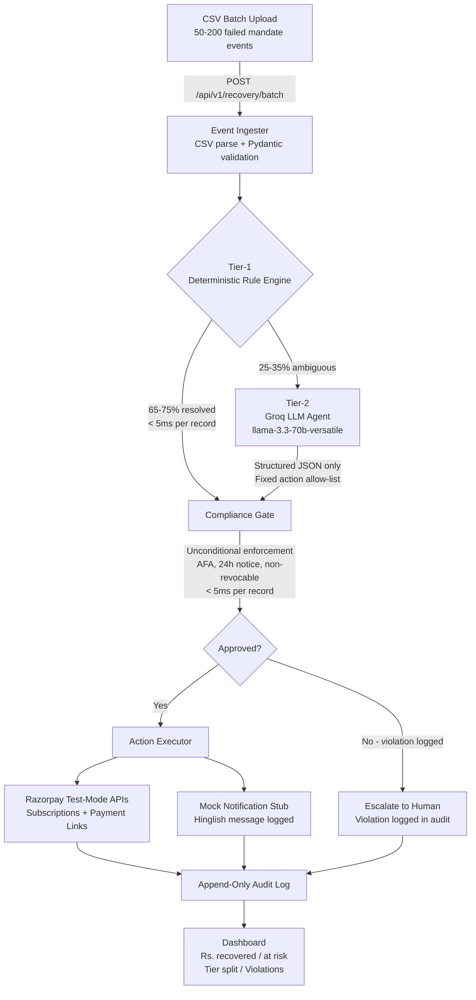
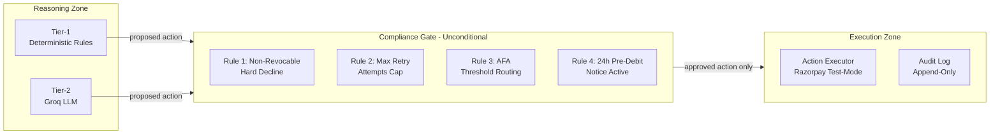
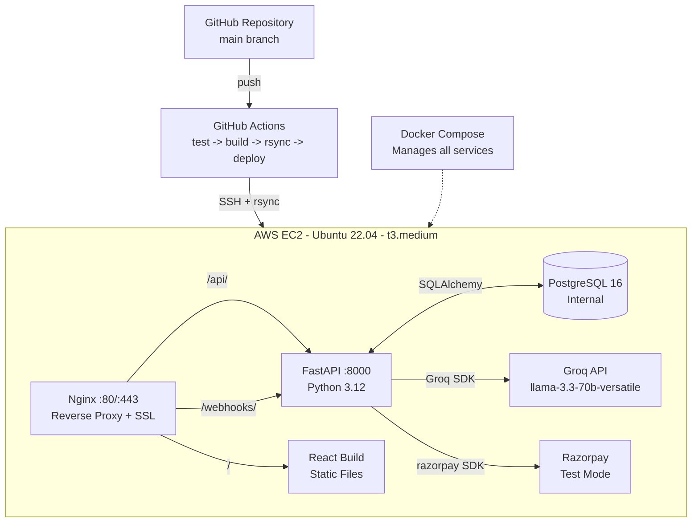

# Aegis

**Compliant UPI Autopay / e-NACH Failure Diagnosis and Recovery Agent**

> Revision 1.0 | Track: AI Revenue Recovery

Aegis is a two-tier failure diagnosis and recovery agent for UPI Autopay and e-NACH mandates. It answers one of the most painful, unsolved problems in Indian fintech: *"Why did my customer's recurring payment fail, and what is the legally compliant action I should take next?"*

Every global dunning tool — Stripe Smart Retries, Churnkey, Butter Payments — is built for card rails. None of them model NPCI mandate mechanics, AFA thresholds, non-revocable loan mandate constraints, or the 24-hour pre-debit notice rule. Aegis is built exclusively for this context.

---

## Architecture

### System Pipeline Flow



### Compliance Enforcement Architecture



### Deployment Architecture



---

## Repository Structure

```
Aegis/
|-- api/
|   |-- main.py                    FastAPI application entry point
|   `-- routes/
|       |-- recovery.py            POST /v1/recovery/batch, GET /v1/recovery/batch/{id}
|       |-- mandates.py            GET /v1/mandates/{id}
|       |-- metrics.py             GET /v1/metrics
|       |-- audit.py               GET /v1/audit
|       |-- human_review.py        GET /v1/human-review
|       `-- webhooks.py            POST /webhooks/razorpay
|-- core/
|   |-- tier1_engine.py            Deterministic rule engine (no LLM)
|   |-- tier2_agent.py             Groq reasoning agent (structured output only)
|   |-- compliance_gate.py         Unconditional compliance enforcement
|   `-- action_executor.py         Razorpay API + mock stub dispatch
|-- services/
|   |-- razorpay_client.py
|   `-- mock_notification.py
|-- audit/
|   `-- log.py                     Append-only audit write
|-- models/
|   |-- mandate_event.py           Pydantic input model
|   |-- recovery_decision.py       Pydantic output model
|   `-- db.py                      SQLAlchemy ORM models
|-- config/
|   `-- loader.py                  compliance_config.yaml loader
|-- synthetic/
|   |-- generator.py               500-record mandate event generator
|   |-- held_out.py                Held-out set management
|   `-- evaluator.py               Held-out evaluation metrics
|-- tests/
|   |-- unit/
|   |   |-- test_tier1.py
|   |   |-- test_compliance_gate.py
|   |   `-- test_tier2_schema.py
|   `-- integration/
|       `-- test_batch_pipeline.py
|-- dashboard/                     React 18 + TypeScript frontend
|-- project-context/               All project documentation (see below)
|-- compliance_config.yaml         Compliance thresholds (committed)
|-- .env.example                   Environment variable template (committed)
|-- docker-compose.yml
|-- requirements.txt
`-- README.md
```

---

## Quick Start

### Prerequisites

- Python 3.12+
- Node.js 20+
- A Groq API key (free tier: [console.groq.com](https://console.groq.com))
- A Razorpay test-mode account

### 1. Clone and install

```bash
git clone https://github.com/AdityaWagh19/Aegis.git
cd Aegis
pip install -r requirements.txt
```

### 2. Configure environment

```bash
cp .env.example .env
# Edit .env and set: GROQ_API_KEY, RAZORPAY_KEY_ID, RAZORPAY_KEY_SECRET
```

### 3. Generate synthetic data (before writing any rules)

```bash
python -m synthetic.generator --count 500 --output data/synthetic.csv --held-out-pct 0.2
```

### 4. Run the backend

```bash
uvicorn api.main:app --reload --port 8000
```

### 5. Run the dashboard

```bash
cd dashboard && npm install && npm run dev
# Dashboard at http://localhost:3000
```

### 6. Run tests

```bash
pytest tests/unit/ -v
pytest tests/unit/test_compliance_gate.py -v   # Run separately — these are critical
```

---

## Core Components

### Tier-1: Deterministic Rule Engine

The rule engine resolves ~65–75% of all failed mandates without any LLM call. It uses a lookup table over the six failure categories with contextual rules for amount thresholds, attempt counts, and salary cycle position.

Key constraints enforced by architecture:
- `core/tier1_engine.py` has zero imports from any LLM module
- Latency target: < 5ms per record

```python
def classify_mandate(event: MandateEvent) -> Tier1Result:
    if event.decline_code == "INSUFFICIENT_FUNDS":
        if event.prior_bounce_count > 3:
            return Tier1Result(action="ESCALATE_TO_HUMAN", ...)
        return Tier1Result(action="SCHEDULE_POST_SALARY", ...)
    elif event.decline_code == "NON_REVOCABLE_HARD_DECLINE":
        return Tier1Result(action="ESCALATE_TO_HUMAN", ...)
    # ... (see core/tier1_engine.py for full implementation)
```

### Tier-2: Groq Reasoning Agent

Handles the ambiguous 25–35% of cases. Constrained to a fixed action allow-list enforced by Pydantic schema validation. Drafts Hinglish customer messages.

```python
ALLOWED_ACTIONS = [
    "RETRY_AFTER_BACKOFF", "SCHEDULE_POST_SALARY", "SEND_UPI_INTENT_PUSH",
    "SEND_MANDATE_RENEWAL_LINK", "SEND_HINGLISH_NUDGE",
    "ESCALATE_TO_HUMAN", "NO_ACTION_MONITORING",
]
```

If the model returns an action outside `ALLOWED_ACTIONS`, Pydantic raises `ValidationError` and the system falls back to `ESCALATE_TO_HUMAN`.

### Compliance Gate

The compliance gate is the single most important component. It enforces four unconditional rules:

| Rule | Trigger | Action |
|---|---|---|
| Non-revocable hard decline | `is_revocable=False` AND `NON_REVOCABLE_HARD_DECLINE` | Only `ESCALATE_TO_HUMAN` permitted |
| Max retry attempts | `attempt_number >= max[mandate_type]` | Reject any retry action |
| AFA threshold routing | `amount > threshold` AND retry proposed | Redirect to `SEND_UPI_INTENT_PUSH` |
| 24h pre-debit notice | `MANDATE_PAUSED` AND retry proposed | Reject retry; allow nudge or escalation |

The compliance gate is a pure function: same inputs always produce the same output. It has unit tests for every rule in isolation.

---

## Compliance Configuration

```yaml
# compliance_config.yaml
afa_threshold_general: 15000          # INR — NPCI general rule
afa_threshold_sip_insurance: 100000   # INR — NPCI SIP/insurance rule

max_retry_attempts:
  UPI_AUTOPAY: 3
  ENACH: 2

pre_debit_notice_window_hours: 24
```

---

## Environment Variables

See `.env.example` for the complete list. Required variables:

| Variable | Description |
|---|---|
| `GROQ_API_KEY` | Groq API key (free tier sufficient for demo scale) |
| `GROQ_MODEL_TIER2` | `llama-3.3-70b-versatile` (primary Tier-2 model) |
| `RAZORPAY_KEY_ID` | Razorpay test-mode key ID (`rzp_test_*`) |
| `RAZORPAY_KEY_SECRET` | Razorpay test-mode key secret |
| `DATABASE_URL` | PostgreSQL or SQLite connection string |
| `SECRET_KEY` | Application secret (64-char hex) |

All Razorpay credentials must be test-mode (`rzp_test_*`). Live keys are never used.

---

## API Reference

| Method | Endpoint | Description |
|---|---|---|
| POST | `/api/v1/recovery/batch` | Upload CSV batch; returns `batch_id` |
| GET | `/api/v1/recovery/batch/{id}` | Poll batch processing results |
| GET | `/api/v1/mandates/{id}` | Full decision trail for one mandate |
| GET | `/api/v1/metrics` | Summary: recovery rate, tier split, violations |
| GET | `/api/v1/audit` | Paginated append-only audit log |
| GET | `/api/v1/human-review` | Human review queue |
| POST | `/webhooks/razorpay` | Razorpay subscription lifecycle events |

---

## Success Metrics

| Metric | Target |
|---|---|
| Tier-1 resolution rate | 65–75% of batch |
| Compliance violations executed | 0 (hard requirement) |
| Compliance violations caught | > 0 (proves gate works) |
| False escalation rate | < 15% |
| Tier-1 latency P95 | < 5ms |
| Tier-2 latency P95 | < 3,000ms |
| Full batch of 50 records | < 30s |

Metrics are reported on the held-out test set (20% of synthetic data reserved before rule-writing began). Results are honest — including anything unflattering.

---

## Design Decisions

**Why Groq instead of Anthropic?** Free API tier, OpenAI-compatible SDK (drop-in replacement), extremely low inference latency. `llama-3.3-70b-versatile` produces reliable structured function calls and handles Hinglish code-switching well.

**Why a lookup table for Tier-1?** The six failure categories are well-defined and deterministic. Using an LLM for cases that have a provably correct answer is both slower and less auditable. The rule engine is the "AI Judgment" demonstration — resisting the urge to over-engineer is the signal.

**Why is the compliance gate a separate component?** To make the architectural constraint visible. The gate receives a proposed action; it does not generate one. Nothing downstream reads the proposed action — only `compliance_result.final_action`. This makes it impossible to accidentally bypass the gate by restructuring the pipeline.

**Why SQLite for development?** Speed of setup during a 13-day build. The audit-log append-only constraint is enforced in application code for SQLite. PostgreSQL is used for production where `REVOKE UPDATE, DELETE ON audit_log FROM aegis_app` provides database-level enforcement.

---

## Documentation

All project documentation is in `project-context/`:

| Document | Contents |
|---|---|
| [`context.md`](project-context/context.md) | Problem, personas, taxonomy, goals, glossary |
| [`compliance.md`](project-context/compliance.md) | The four compliance rules, gate implementation, allow-list |
| [`architecture.md`](project-context/architecture.md) | System design, DB schema, state machines, performance targets |
| [`api.md`](project-context/api.md) | REST API spec, Razorpay integrations, mock stub |
| [`dev-guide.md`](project-context/dev-guide.md) | Local setup, stack, env vars, code conventions |
| [`test.md`](project-context/test.md) | Test strategy, all test cases, held-out evaluation protocol |
| [`deploy.md`](project-context/deploy.md) | EC2, Nginx, Docker, CI/CD, secrets |
| [`demo.md`](project-context/demo.md) | 5-minute demo script, submission checklist |
| [`tasks.md`](project-context/tasks.md) | Feature-level task checklist, updated daily |
| [`progress.md`](project-context/progress.md) | Daily build log (becomes `BUILD_LOG.md`) |
| [`future-plans.md`](project-context/future-plans.md) | Post-MVP roadmap, stretch goal, open questions |
| [`Master_Aegis.md`](project-context/Master_Aegis.md) | Original design brief (historical reference) |

**Recommended reading order for a new contributor:**

```
context.md -> compliance.md -> architecture.md -> dev-guide.md -> test.md -> tasks.md
```

---

## Engineering Constraints

| Constraint | Value |
|---|---|
| LLM on compliance decisions | Not permitted |
| Tier-2 volume | Must not exceed ~30% of the batch |
| Real customer PII | Not permitted — synthetic data only |
| Live Razorpay transactions | Not permitted — test-mode only |
| Real WhatsApp/SMS delivery | Not in MVP — mock stub only |

---

*Aegis — Compliant UPI Autopay / e-NACH Failure Diagnosis and Recovery Agent*
