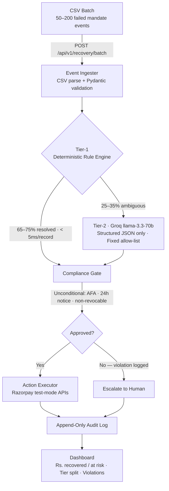
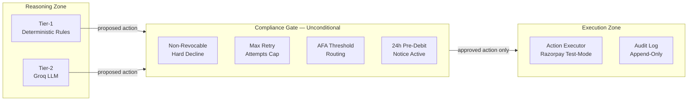

# Aegis

**Compliant UPI Autopay / e-NACH Failure Diagnosis and Recovery Agent**

Indian subscription businesses and NBFCs lose 10–20% of recurring revenue to UPI Autopay and e-NACH mandate failures. The failure modes are structurally Indian — they involve NPCI mandate mechanics, RBI notice rules, and salary-cycle timing that no global dunning tool (Stripe Smart Retries, Churnkey, Butter Payments) has ever modeled.

Aegis is a two-tier agent that ingests a batch of failed mandates, diagnoses each one by root cause, selects a legally compliant recovery action, executes it against Razorpay's test-mode APIs, and reports honest recovery metrics — with a deterministic compliance gate that cannot be bypassed by any LLM output.

---

## How It Works



---

## The Six Failure Categories

The taxonomy is the intellectual core of the product. Every Tier-1 rule, every Tier-2 prompt, and every compliance rule derives from this table.

| Decline Code | Root Cause | Correct Action | Why Global Tools Fail |
|---|---|---|---|
| `INSUFFICIENT_FUNDS` | Debit before salary credit | `SCHEDULE_POST_SALARY` | Card retries assume funds are immediately available |
| `AFA_REQUIRED` | Silent debit above NPCI Rs. 15,000 threshold | `SEND_UPI_INTENT_PUSH` | Card rails have no equivalent concept |
| `MANDATE_PAUSED` | Customer paused via RBI 24h pre-debit notice | `SEND_HINGLISH_NUDGE` | No global equivalent; the pause is a legal right |
| `BANK_TECHNICAL_DECLINE` | Bank timeout / downtime | `RETRY_AFTER_BACKOFF` | Identical on card rails — this one global tools handle correctly |
| `NON_REVOCABLE_HARD_DECLINE` | Loan EMI, 2nd hard decline | `ESCALATE_TO_HUMAN` | Card-rail assumption: always retry |
| `MANDATE_EXPIRED` | e-mandate validity window lapsed | `SEND_MANDATE_RENEWAL_LINK` | Card tokens don't expire the same way |

---

## Compliance Gate

The compliance gate is an unconditional code path — not a feature, not configurable, not bypassable by any LLM output. Every proposed action from Tier-1 or Tier-2 passes through it before execution.



| Rule | Trigger | Gate Behaviour |
|---|---|---|
| Non-revocable hard decline | `is_revocable=False` AND `NON_REVOCABLE_HARD_DECLINE` | Only `ESCALATE_TO_HUMAN` permitted — zero exceptions |
| Max retry cap | `attempt_number >= max[mandate_type]` (UPI: 3, NACH: 2) | Reject any retry action |
| AFA threshold routing | `amount > Rs. 15,000` AND retry proposed | Redirect to `SEND_UPI_INTENT_PUSH` — silent retry violates NPCI |
| 24h pre-debit notice | `MANDATE_PAUSED` AND retry proposed | Reject retry — pausing is a legal customer right under RBI rules |

The gate is a pure function (same inputs, same output always) with unit tests for every rule in isolation. Every violation it catches is logged in the audit trail.

---

## Repository Structure

```
Aegis/
├── core/
│   ├── tier1_engine.py        Deterministic rule engine — zero LLM imports
│   ├── tier2_agent.py         Groq reasoning agent — structured output only
│   ├── compliance_gate.py     Unconditional compliance enforcement
│   └── action_executor.py     Razorpay API + mock notification dispatch
├── api/
│   └── routes/                recovery, mandates, metrics, audit, human-review, webhooks
├── models/                    Pydantic + SQLAlchemy schemas
├── synthetic/                 Generator, held-out split, held-out evaluator
├── tests/
│   ├── unit/                  test_tier1.py, test_compliance_gate.py, test_tier2_schema.py
│   └── integration/           test_batch_pipeline.py
├── dashboard/                 React 18 + TypeScript frontend
├── project-context/           All project documentation
├── compliance_config.yaml     AFA thresholds, retry caps (committed)
└── .env.example               Environment variable template
```

---

## Quick Start

**Prerequisites:** Python 3.12+, Node.js 20+, [Groq API key (free)](https://console.groq.com), Razorpay test-mode account.

```bash
# 1. Clone and install
git clone https://github.com/AdityaWagh19/Aegis.git
cd Aegis
pip install -r requirements.txt

# 2. Configure environment
cp .env.example .env
# Set GROQ_API_KEY, RAZORPAY_KEY_ID, RAZORPAY_KEY_SECRET in .env

# 3. Generate synthetic data — do this before writing any rules
python -m synthetic.generator --count 500 --output data/synthetic.csv --held-out-pct 0.2

# 4. Run the backend
uvicorn api.main:app --reload --port 8000

# 5. Run the dashboard
cd dashboard && npm install && npm run dev
# http://localhost:3000

# 6. Run tests
pytest tests/unit/ -v
pytest tests/unit/test_compliance_gate.py -v    # critical — run separately
```

---

## API

| Method | Endpoint | Description |
|---|---|---|
| `POST` | `/api/v1/recovery/batch` | Upload CSV batch of failed mandates |
| `GET` | `/api/v1/recovery/batch/{id}` | Poll batch processing results |
| `GET` | `/api/v1/mandates/{id}` | Full decision trail for a single mandate |
| `GET` | `/api/v1/metrics` | Recovery rate, tier split, violations caught/executed |
| `GET` | `/api/v1/audit` | Paginated append-only audit log |
| `GET` | `/api/v1/human-review` | Human review queue |
| `POST` | `/webhooks/razorpay` | Razorpay subscription lifecycle events |

Full request/response schemas: [`project-context/api.md`](project-context/api.md)

---

## Configuration

```yaml
# compliance_config.yaml — committed, no secrets
afa_threshold_general: 15000         # INR — NPCI general rule
afa_threshold_sip_insurance: 100000  # INR — NPCI SIP/insurance rule

max_retry_attempts:
  UPI_AUTOPAY: 3
  ENACH: 2

pre_debit_notice_window_hours: 24
```

Key environment variables (see `.env.example`):

| Variable | Purpose |
|---|---|
| `GROQ_API_KEY` | Tier-2 LLM (free tier handles demo scale comfortably) |
| `GROQ_MODEL_TIER2` | `llama-3.3-70b-versatile` |
| `RAZORPAY_KEY_ID` / `RAZORPAY_KEY_SECRET` | Test-mode only (`rzp_test_*`) |
| `DATABASE_URL` | SQLite for dev, PostgreSQL for production |

---

## Success Metrics

All metrics are reported on the held-out test set (20% of synthetic data, reserved before any rule-writing began).

| Metric | Target |
|---|---|
| Tier-1 resolution rate | 65–75% |
| Compliance violations executed | **0** (hard requirement) |
| Compliance violations caught | > 0 (proves the gate works) |
| False escalation rate | < 15% |
| Tier-1 latency P95 | < 5ms |
| Tier-2 latency P95 | < 3,000ms |

---

## Design Decisions

**Majority-deterministic architecture.** ~65–75% of cases are resolved by the Tier-1 rule engine with zero LLM calls. This is a deliberate design choice: using an LLM for cases that have a provably correct deterministic answer is slower, less auditable, and harder to test. The Tier-1 resolution rate is tracked on the dashboard — if it drops below 65%, the rule engine needs improvement, not more LLM calls.

**Compliance gate as a structural constraint.** The gate is not a validation layer inside the pipeline — it is a structural separation between the reasoning zone and the execution zone. Nothing downstream reads the `proposed_action` directly. Only `compliance_result.final_action` reaches the executor. This makes it architecturally impossible to accidentally bypass the gate.

**Pydantic-enforced action allow-list.** Tier-2's output schema uses a `Literal` type over `ALLOWED_ACTIONS`. Any response from the LLM containing an action outside this enum fails Pydantic validation and falls back to `ESCALATE_TO_HUMAN`. The LLM cannot invent a new action at runtime.

**Groq over Anthropic.** Free API tier, OpenAI-compatible interface, sub-second P95 latency on `llama-3.3-70b-versatile`. A 200-record demo batch generates 50–70 Tier-2 calls — well within free-tier rate limits.

---

## Documentation

| Document | Purpose |
|---|---|
| [`context.md`](project-context/context.md) | Problem, personas, taxonomy, goals, glossary |
| [`compliance.md`](project-context/compliance.md) | All four compliance rules, gate implementation |
| [`architecture.md`](project-context/architecture.md) | DB schema, state machines, performance targets |
| [`api.md`](project-context/api.md) | REST endpoints, Razorpay integrations |
| [`dev-guide.md`](project-context/dev-guide.md) | Local setup, stack, env vars, code conventions |
| [`test.md`](project-context/test.md) | All test cases, held-out evaluation protocol |
| [`deploy.md`](project-context/deploy.md) | EC2, Nginx, Docker Compose, GitHub Actions CI/CD |
| [`demo.md`](project-context/demo.md) | 5-minute demo script, pre-demo checklist |
| [`tasks.md`](project-context/tasks.md) | Day-by-day build checklist |
| [`progress.md`](project-context/progress.md) | Daily build log → `BUILD_LOG.md` at submission |

---

*Aegis — Compliant UPI Autopay / e-NACH Failure Diagnosis and Recovery Agent*
